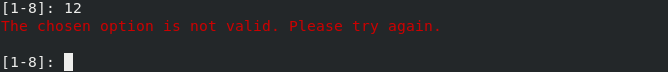

# Utilização

#### Obtenção do programa

O executável deste programa pode ser descarregado a partir desta ligação:

<https://github.com/ajcerejeira/udtc/raw/master/udtc.jar>

Também pode descarregar o todo o conteudo do projeto através do `git`:

    git clone https://github.com/ajcerejeira/udtc
    cd udtc/

#### Execução e compilação

Na pasta raíz do projecto encontra-se o ficheiro `udtc.jar` pronto a ser
executado. Deste modo, para iniciar o programa basta correr o seguinte comando
na raíz do projeto:

    $ java -jar udtc.jar

Pode também compilar o programa se assim o desejar. O seu código-fonte
encontra-se na pasta `src` e pode ser compilado recorrendo à ferramenta `javac`
ou então, através de um ambiente de desenvolvimento integrado que suporte
`JAVA`.

Após o programa se encontrar compilado, e encontrando-se na directoria onde se
encontram os resultados da compilação, basta correr o seguinte comando para
iniciar a aplicação:

    $ java Main

#### Navegação pela interface

Tal como sugerido no enunciado deste trabalho prático, o modo de utilização da
aplicação passa pela navegação de menus puramente textuais. Cada um destes menus
apresenta um título (e alguns também um subtítulo) bastante visíveis, indicando
o modo atual em utilização da calculadora. De seguida é apresentada uma lista
numerada com todas as opções disponíveis no modo atual. O utilizador deve então
introduzir a opção pretendida no *prompt* e pressionar a tecla `<ENTER>`, sendo
conduzido para o menu seguinte.

#### Prompt

O *prompt* (pequeno texto que aparece antes do local de introdução do
utilizador) indica para cada menu qual o intervalo de opções disponíveis. Regra
geral a última opção é a de saída ou retorno ao menu anterior. Quando o
utilizador introduz um número inválido, o programa pede para repetir a sua
escolha novamente.

