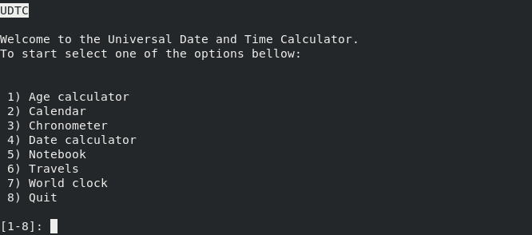

# Utilização

#### Execução e inicialização

Antes de executar o programa é necessário compilá-lo. O seu código-fonte
(escrito em `JAVA8`) encontra-se na pasta `src` e pode ser compilado recorrendo
à ferramenta `javac` ou então, através de um ambiente de desenvolvimento
integrado que suporte `JAVA`.

Após o programa se encontrar compilado, e encontrando-se na directoria onde se
encontra o executável, basta correr o comando:

    java Main

Para iniciar a aplicação.

#### Navegação pela interface

Tal como sugerido no enunciado deste trabalho prático, o modo de utilização da
aplicação passa pela navegação de menus puramente textuais. Cada um destes menus
apresenta um título (e alguns também um subtítulo) bastante visíveis, indicando
o modo atual em utilização da calculadora. De seguida é apresentada uma lista
numerada com todas as opções disponíveis no modo atual. O utilizador deve então
introduzir a opção pretendida no *prompt* e pressionar a tecla `<ENTER>`, sendo
conduzido para o menu seguinte.

#### Prompt

O *prompt* (pequeno texto que aparece antes do local de introdução do
utilizador) indica para cada menu qual o intervalo de opções disponíveis. Regra
geral a última opção é a de saída ou retorno ao menu anterior. Quando o
utilizador introduz um número inválido, o programa pede para repetir a sua
escolha novamente.

