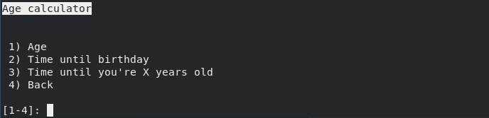
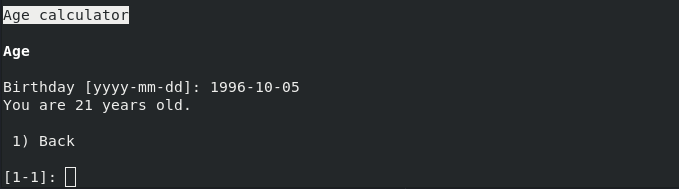
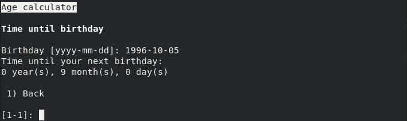
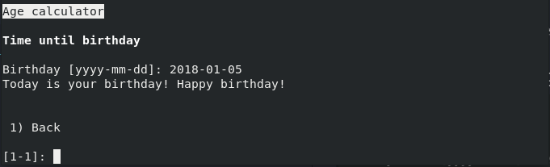
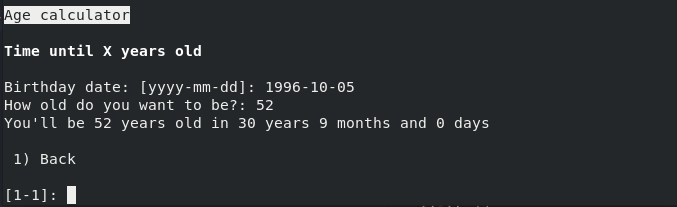

## Calculadora de idades

A calculadora de idades permite efetuar algumas operações relacionadas com
datas de aniversário, permitindo calcular uma determinada idade, quanto tempo
até ao próximo aniversário e quanto tempo demorará a atingir uma determinada
idade.

