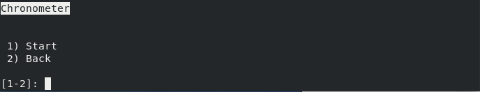

## Cronómetero

O cronómetro permite contar o tempo desde a sua execução, permitindo efetuar
pausas e retomar a contagem. Os resultados da contagem são mostrados sempre
que o cronómetro é pausado ou parado. Infelizmente, por se tratar de uma
interface textual é bastante complicado imprimir o valor da contagem em tempo
real, pois tal envolveria mecanismos de limpeza e escrita de ecrã que não são
bem suportados em muitas plafatormas. Em todo o caso, a interface mantém-se
simples e de fácil utilização.

