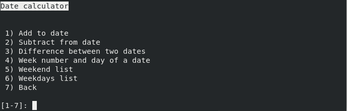
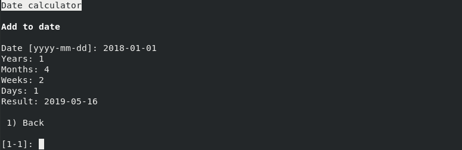
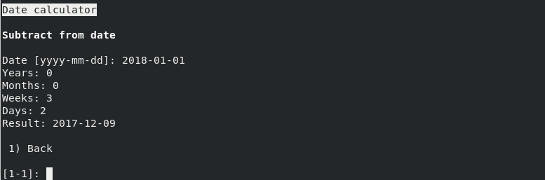
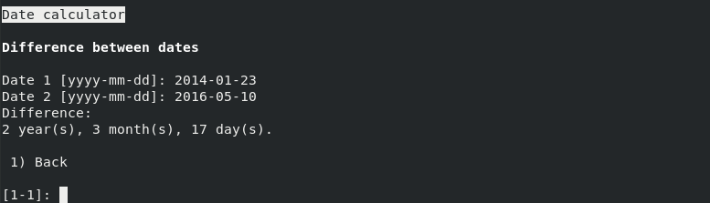
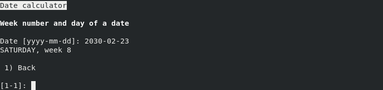
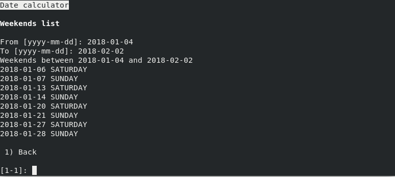
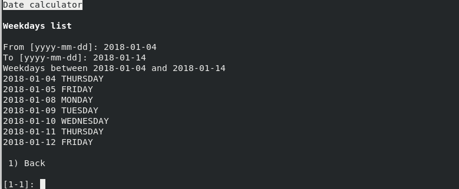

## Calculadora de datas

A calculadora de datas é um dos modos mais extensos e mais completos deste
programa. Ela permite efetuar cálculos com datas, entre os quais a adição e
subtração de datas, diferença entre duas datas. Tem também algumas funções
de calendário, já que permite listar os dias e fins de semana entre duas datas,
bem como descobrir o número de uma semana e o dia da semana de qualquer data.

