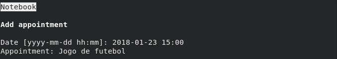
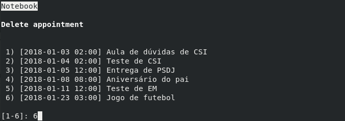
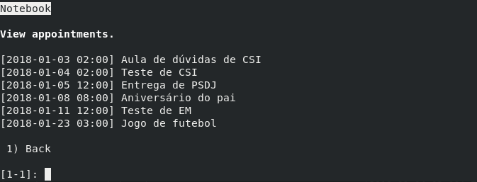
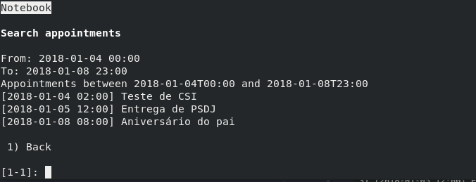

## Agenda

A agenda consiste na agregação de diversos eventos, que são simplesmente
compostos por uma data de ocorrência e uma breva descrição. Para inserir e
remover eventos utilizam-se as opções `1) Add appointment` e
`2) Delete appointment` respetivamete.

Obviamente que é possível visualizar todos os eventos da agenda, como também
filtrá-los por data e hora. Nestas listagens os eventos aparecem sempre
ordenados por data

#### Serialização

É possível guardar e carregar o estado de uma agenda para um formato textual.
Para tal utilizam-se os comandos `4) Save notebook` para guardar num ficheiro
os eventos que se encontram na agenda, e `5) Read notebook` para ler de um
ficheiro esses mesmos eventos.

Abaixo se ilustra um exemplo de um ficheiro de dados gerado pela agenda:

    [2018-01-03 02:00] Aula de dúvidas de CSI
    [2018-01-04 02:00] Teste de CSI
    [2018-01-05 12:00] Entrega de PSDJ
    [2018-01-08 08:00] Aniversário do pai
    [2018-01-11 12:00] Teste de EM

Ao extrair a agenda para um formato textual torna-se então possível ao
utilizador editar a própria agenda mesmo fora da aplicação. Para tal basta
utilizar um editor de texto para inserir ou remover novos eventos neste
ficheiro, e posteriormente relê-lo com a aplicação. Esta funcionalidade também
permite a fácil partilha de agendas entre vários utilizadores.
