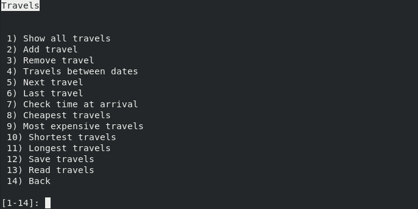
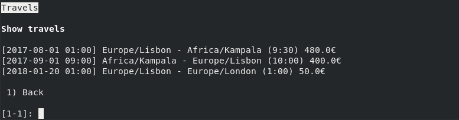
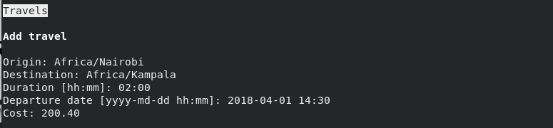
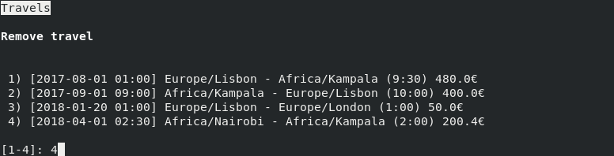
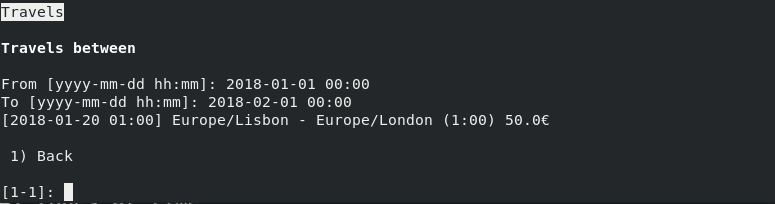
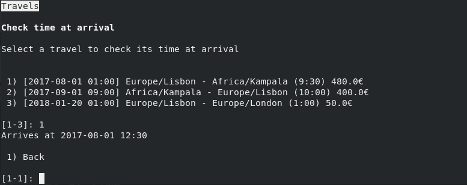
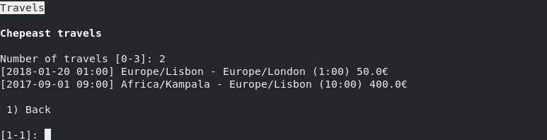
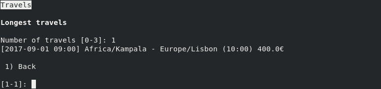

## Viagens

O modo de gestão de viagens inclui várias ferramentas de conveniência para o
cálculo de estimativas de duração de viagens, cálculo de tempos de chegada,
etc...

#### Serialização

Tal como a agenda, o modo de gestão de viagens também permite guardar e ler
a lista das viagens para um formato textual.

Exemplo de ficheiro de viagens:

    [2017-08-01 01:00] Europe/Lisbon - Africa/Kampala (9:30) 480.0€
    [2017-09-01 09:00] Africa/Kampala - Europe/Lisbon (10:00) 400.0€
    [2018-01-20 13:00] Europe/Lisbon - Europe/London (01:00) 50.0€
