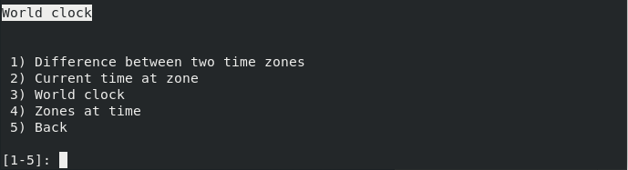

## Relógio universal

O relógio universal contém funcionalidades úteis para manipulação de diversos
fusos horários. Permite o cálculo das diferenças de tempo entre duas zonas
do globo, verficar qual a hora atual numa determinada zona, mostrar que zonas
se encontram atualmente numa determinada hora e imprimir a data e hora atuais de
todas as regiões do mundo.

