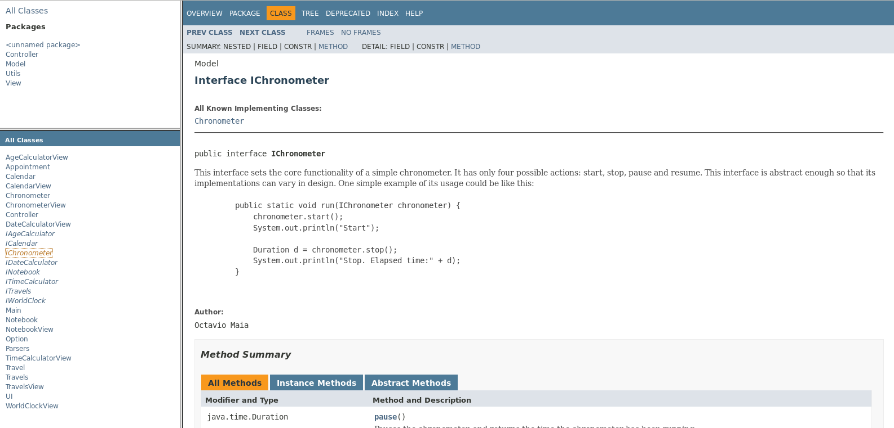

# Implementação

## Documentação

Toda a documentação do código fonte foi efetuada recorrendo à ferramenta
`JAVADOC` e hospedada como um site do GitHub pages. Esta pode ser consultada em <https://ajcerejeira.github.io/udtc/>. Lá encontram-se documentadas as classes
criadas propositadamente para este programa, encontrando-se informações sobre
o seu propósito, implementação e modo de utilização.

