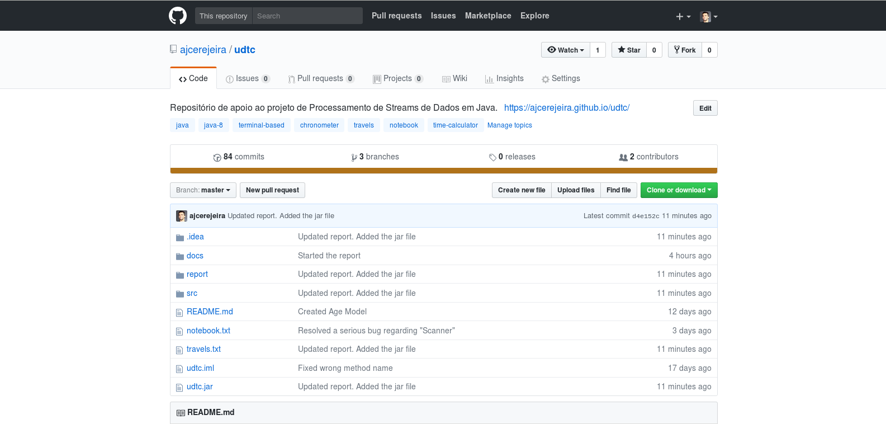

# Implementação

## Arquitectura

Para garantir uma separação de componentes baseada na sua função, recorreu-se ao
padrão de arquitetura de *software*
[MVC](https://en.wikipedia.org/wiki/Model%E2%80%93view%E2%80%93controller).

Deste modo o projeto dividiu-se nos três *packages* que compõem a arquitetura
`MVC`:

 - `Model` - núcleo do projeto, definia interfaces e suas implementações para
             os diversos modos da aplicação. Neste projeto insistiu-se numa
             primeira fase na definição de `Interfaces` de `JAVA` que ditavam
             os métodos que determinado modo deveria seguir. Aliás, garantiu-se
             que os outros *packages* só acediam a métodos definidos nas
             interfaces. Estando as interfaces já definidas começou-se a
             codificação das classes que as implementavam.
 - `View` - que para cada interface definida no *package* `Model` codificava a
            interação textual com o utilizador.
 - `Controller` - que instanciava objetos que implementavam as interfaces
                  definidas no *package* `Model` e os passava para a `View`.

Com esta arquitectura o processo de desenvolvimento do projeto decorreu com
sucesso. Reforça-se ainda a ideia bem sucedida de definir primeiro as
interfaces e só depois as implementar, o que facilitou a divisão das tarefas:
era assim possível implementar as *view* para essa interface ao mesmo tempo que
a sua implementação.

Foi ainda criado um outro *package* denominado `Utils` que continha código
utilizado por todos os outros packages de utilidade geral. Este era composto
pelas seguintes classes:

 - `UI` - classe composta por métodos estáticos que facilitam a renderização da
          interface textual. Inclui o desenho de títulos, subtítulos, menus e
          introdução textual do utilizador, e impressão de listas de objetos.
          Com recurso às novas funcionalidades do `JAVA 8` (lambdas, referências
          a métodos, `Optional`) é muito mais simples e eficaz a criação de
          novas interfaces.
 - `Option` - classe auxiliar utilizada simplesmente para o desenho de menus.
              Estes são compostos por várias `Option`, sendo que cada uma
              contém um determinado título e a ação a executar quando esta opção
              é escolhida. Esta ação não é mais do que um objecto que implemente
              a interface `Runnable`.
 - `Parsers` - classe auxiliar que inclui *parsers* de datas, tempos, durações,
               zonas e números. Cada parser apresenta a seguinte assinatura:
               `static Optional<T> parse(String input)`{.java}, onde `T` é o
               tipo de dados que se pretende obter com o resultado do *parsing*.
               Repare-se na utilização da nova classe do `JAVA 8`, `Optional`
               para indicar se o *parsing* foi ou não bem sucedido.

## Controlo de versões

Tal como ditam as regras do bom desenvolvimento de *software*, utilizou-se a
ferramenta `git` como método de controlo de versões durante o desenvolvimento do
programa. Esta ferramenta foi bastante útil para a coordenação do projeto entre
os dois membros do grupo: cada um utilizou um `branch` próprio onde ia
desenvolvendo as suas soluções para os problemas, evitando assim conflitos no
código. No final os `branches` foram agregados resultando num projeto
sustentável e modular.

Todo o código do projeto (este relatório inclusive) foi hospedado no `GitHub` no
seguinte repositório:

<https://github.com/ajcerejeira/udtc>

## Documentação

Toda a documentação do código fonte foi efetuada recorrendo à ferramenta
`JAVADOC` e hospedada como um site do GitHub pages. Esta pode ser consultada
diretamente em <https://ajcerejeira.github.io/udtc/>. Lá encontram-se
documentadas as classes criadas propositadamente para este programa,
encontrando-se informações sobre o seu propósito, implementação e modo de
utilização.

